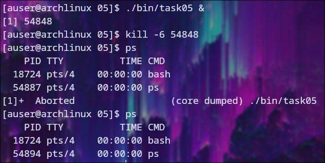
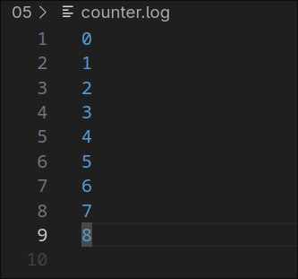
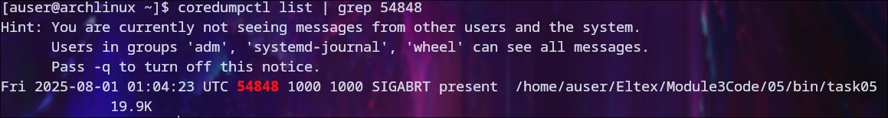
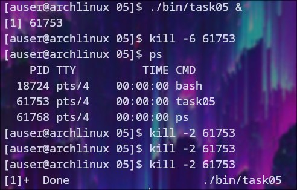

# Проверка сигнала SIGABRT

## Неперехваченный сигнал

### Если не перехватывать сигнал, программа завершится после его получения

### Файл с результатами

### Также был создан дамп файл

##Перехваченный сигнал

### Данный сигнал успешно перехватывается

### Файл с результатами
