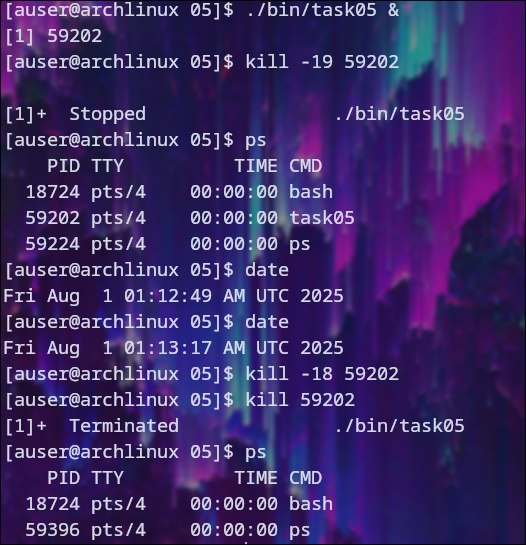

# Проверка сигнала SIGSTOP

## Неперехваченный сигнал

### При получении сигнала процесс останавливается. После получения процессом сигнала SIGCONT он возобновляется

### Файл с результатами

## Перехваченный сигнал

### Данный сигнал нельзя перехватить, поэтому при попытке его перехвата процесс все равно остановится

### Файл с результатами
