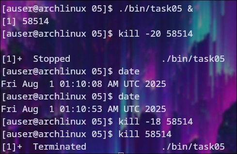
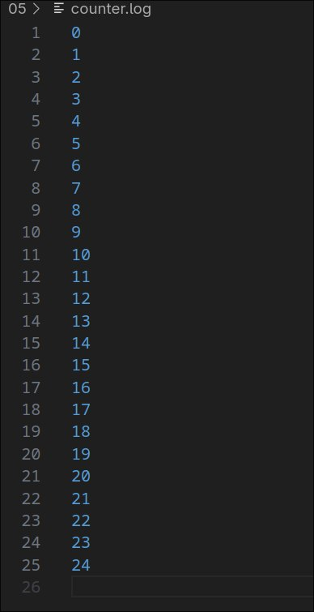

# Проверка сигнала SIGSTP

## Неперехваченный сигнал

### При получении данного сигнала процесс останавливается. Затем его можно разбудить с помощью SIGCONT

### Файл с результатами

## Перехваченный сигнал

### Данный сигнал можно удачно перехватить, и процесс не остановится
