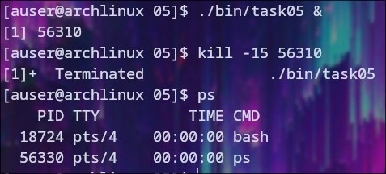
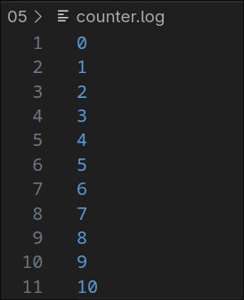
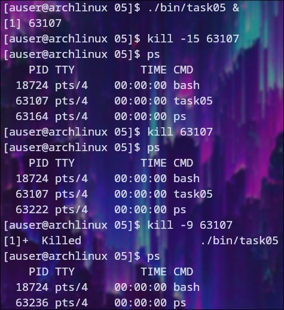

# Проверка сигнала

## Неперехваченный сигнал

### При получении данного сигнала процесс завершает свою работу

### Файл с результатами

## Перехваченный сигнал

### Данный сигнал можно удачно перехватить
