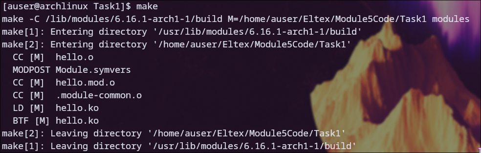
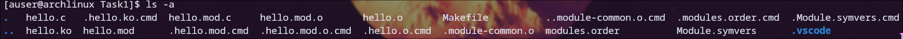
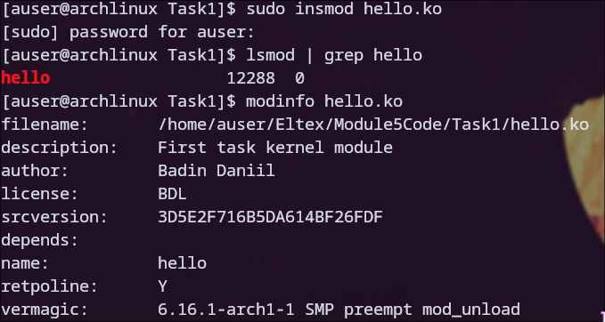
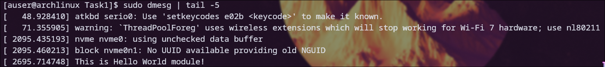
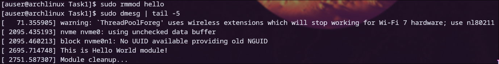

# Задание 1

### Для начала была произведена компиляция модуля

### Компимлятор создал объектные файлы, временные файлы компиляции и итоговый модуль

### Далее производилась загрузка модуля в ядро с помощью insmod
### Через lsmod было определено, что модуль загружен успешно
### Также с помощью modinfo были просмотрены все измененные поля информации о модуле (автор, лицензия, описание)

### Далее был проверен системный журнал, в котором было замечено сообщение от модуля

### После этого модуль был выгружен из ядра, а в системном журнале появилось соответствующее сообщение

