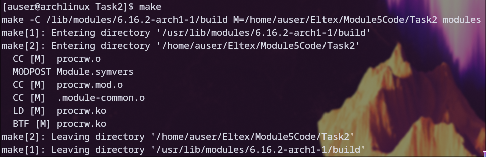
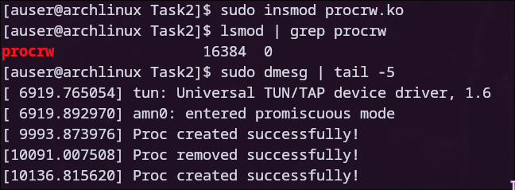
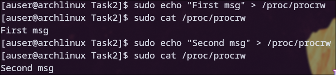
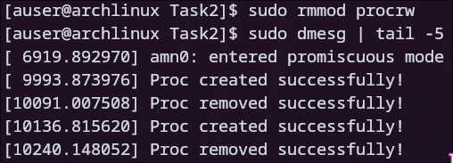

# Задание 2

### Для начала была произведена компиляция модуля

### После этого модуль был загружен с помощью insmod, также был проверен список активных модулей и системный журнал

### Ниже представлен результат небольшого проведенного теста модуля

### После этого модуль был выгружен из ядра, а в системном журнале появилось соответствующее сообщение

