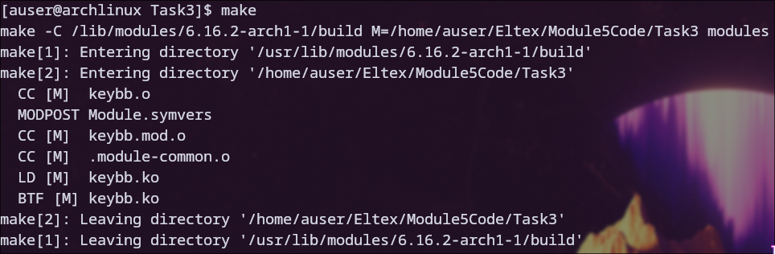
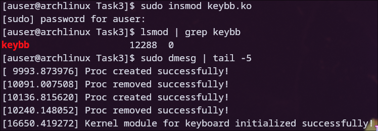
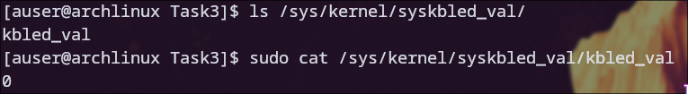
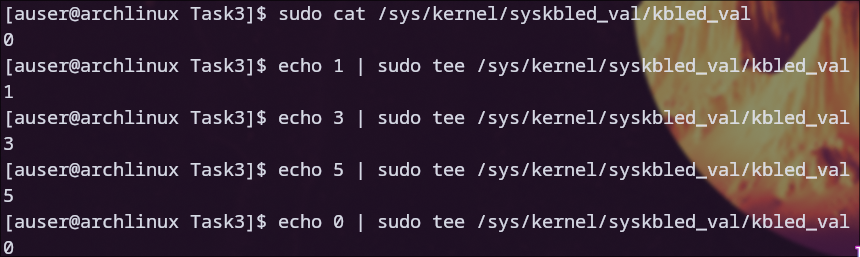
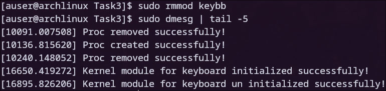

# Задание 3

### Для начала была произведена компиляция модуля

### После этого модуль был загружен с помощью insmod, также был проверен список активных модулей и системный журнал

### Также было проверено создание соответствующего файла в sysfs

### Ниже представлен пример использования модуля

### После этого модуль был выгружен из ядра, а в системном журнале появилось соответствующее сообщение

## Примеры работы
 
### Значение: 1 (001) = ScrollLock

### Значение: 5 (101) = ScrollLock + CapsLock

