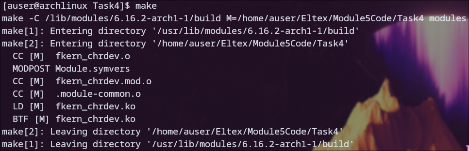
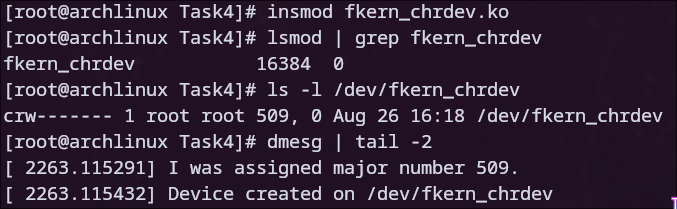
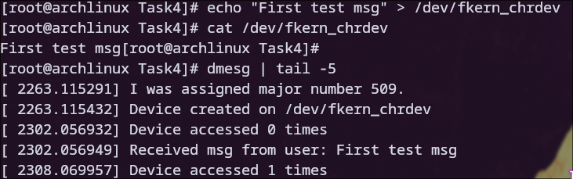
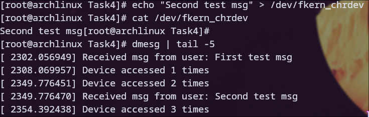
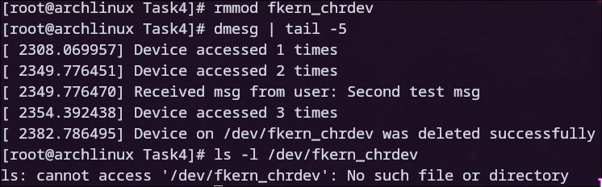

# Задание 4

### Для начала была произведена компиляция модуля

### После этого модуль был загружен с помощью insmod, также был проверен список активных модулей и системный журнал

### После этого была произведена проверка созданного символьного устройства

### После этого модуль был выгружен из ядра, а в системном журнале появилось соответствующее сообщение

