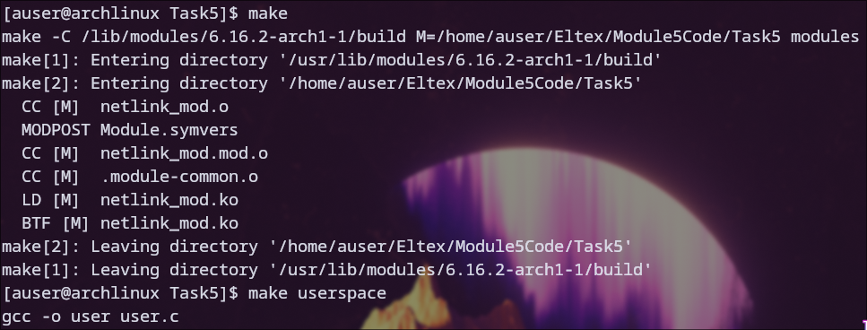
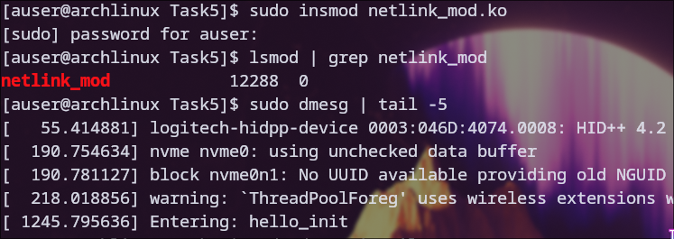
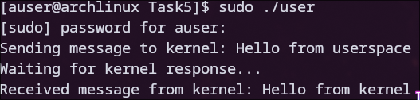
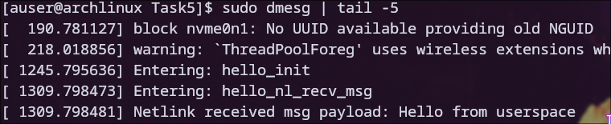
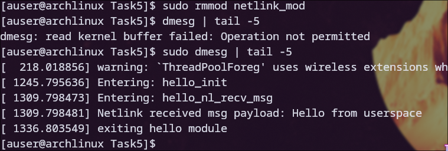

# Задание 5

### Для начала была произведена компиляция модуля

### После этого модуль был загружен с помощью insmod, также был проверен список активных модулей и системный журнал

### После этого была запущена пользовательская программа (user.c), в которой можно заметить сообщение от ядра

### После этого в системном журнале было замечено уведомление о получении ядром соответствующего сообщения

### После этого модуль был выгружен из ядра, а в системном журнале появилось соответствующее сообщение

