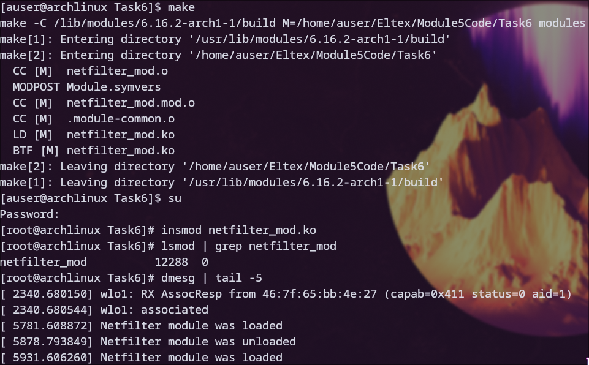
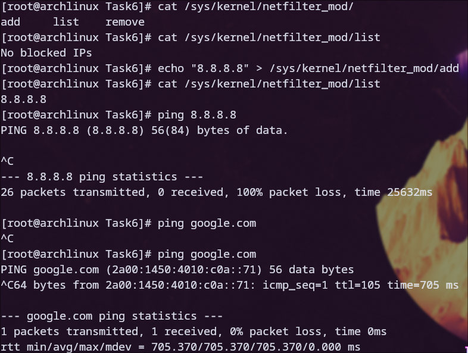
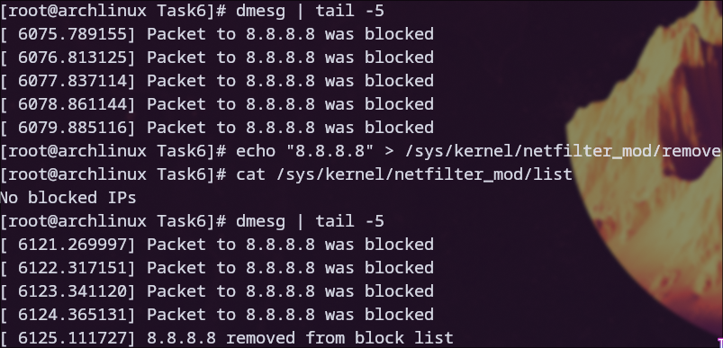
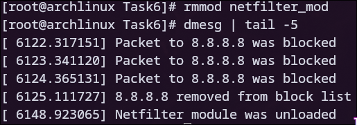

# Задание 6

### Для начала была произведена компиляция модуля и его загрузка

### После этого через соответствующий каталог и файл в sysfs в черный список был добавлен DNS сервер Google. После этого производилась попытка пропинговать его и google.com. Второй был пропингован успешно, связано это с тем, что в у меня в системе настроено несколько DNS серверов (например DNS сервер Cloudflare 1.1.1.1).

### В системнео журнале можно замтетить сообщения о блокировке соответствующих пактов. После этого была проверена функция удаления адресов из черного списка.

### После этого модуль был выгружен из ядра, а в системном журнале появилось соответствующее сообщение

